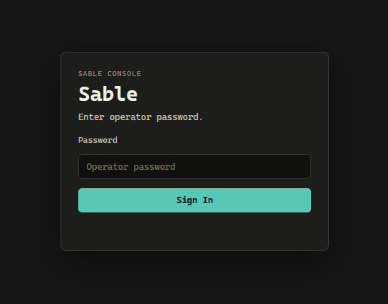
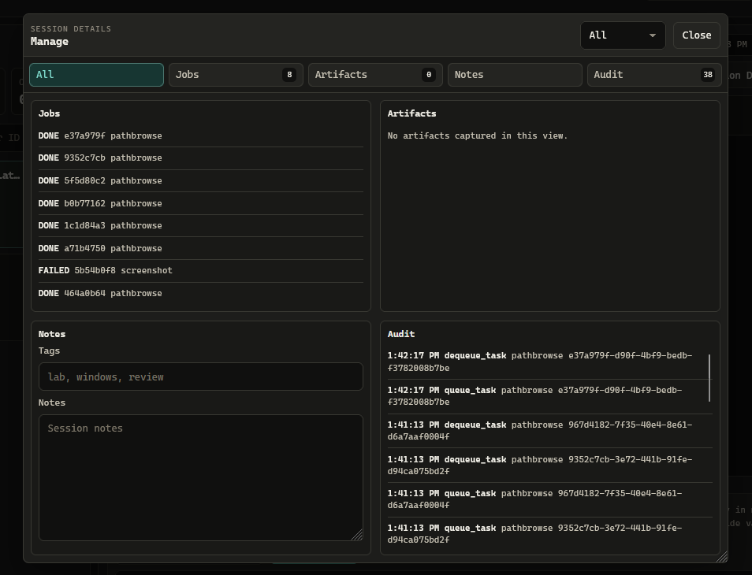
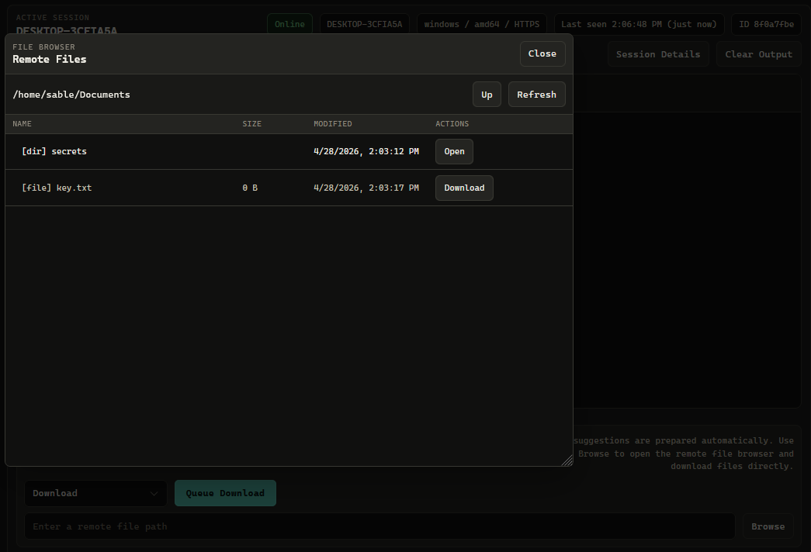
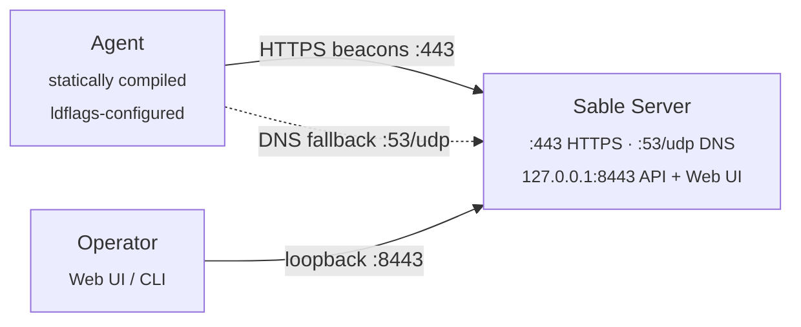

<h1 align="center">Sable</h1>

<p align="center">
  Open source C2
</p>

<p align="center">
  Go | HTTPS + DNS transports | Web UI + CLI
</p>

Sable is a C2 written in Go. The server takes encrypted beacons from agents over HTTPS, with DNS as a fallback, and exposes a browser console and an interactive CLI for tasking.

---

## Interface Preview

Password-gated operator console on loopback HTTPS:



Active session view with command output, the Task Builder, and the full action menu:


Session details rail for jobs, artifacts, notes, and audit history:



Remote file browser for selecting download paths:



---

## Authorized Use

Sable is intended for educational use, controlled labs, CTFs, owned systems, and engagements where you hold written authorization. Do not deploy it against systems you do not own or do not have explicit permission to test. The author accepts no responsibility for misuse.

---

## Architecture



See [docs/architecture.md](docs/architecture.md) for the crypto details, network ports, and project layout.

---

## Prerequisites

- Go 1.26.2 or later (matches `go.mod`)
- `make` (Linux, macOS, or Windows; PowerShell or cmd)
- Root / admin on the server host if binding `443` (and `53` when DNS fallback is on)

Agents cross-compile through `GOOS`/`GOARCH`, so you can build from any host OS.

---

## Quick Start

### 1. Clone

```sh
git clone https://github.com/aelder202/sable
cd sable
```

Modules pull on the first build. Run `go mod download` if you want to pre-warm the cache.

### 2. Install

Build the unified helper, then let it create the local config, TLS certificate, server binary, selected agent binaries, and `.sable/install.json` manifest.

```sh
make sablectl
./sablectl install --url https://<your-server-ip>:443 --password-file ./pw.txt
```

`--password-file` is optional but recommended: when supplied, `install` creates the file (with a random password if it doesn't already exist) and records its path in `.sable/install.json`. `sablectl start` and `sablectl agent register` reuse that path automatically, so you don't need to retype `--password-file` on every command.

To build both Linux and Windows agents with separate identities:

```sh
./sablectl install --url https://<your-server-ip>:443 --password-file ./pw.txt --agents both --windows-label win01
```

`SERVER_URL` is the address agents beacon to, not the operator UI. `sablectl install` writes `config.env`, `server.crt`, `server.key`, `.sable/install.json`, and builds artifacts under `builds/<label>/`. These files are gitignored and include secrets.

### 3. Start

Keep the server binary, `server.crt`, and `server.key` in the same directory. If you ran `install --password-file ./pw.txt`, just run:

```sh
./sablectl start             # Linux / macOS
.\sablectl.exe start         # Windows
```

`start` reads the password file path from `.sable/install.json`. To override it for one run, or if you skipped the flag during install, point at a file directly:

**Linux / macOS**

```sh
printf '%s' 'yourpassword' > ./pw.txt
chmod 600 ./pw.txt
./sablectl start --password-file ./pw.txt
```

**Windows (PowerShell)**

```powershell
Set-Content -Encoding ascii -NoNewline .\pw.txt "yourpassword"
.\sablectl.exe start --password-file .\pw.txt
```

`SABLE_OPERATOR_PASSWORD` and stdin both work too.

By default the server persists operator state to `sable-state.json` in the working directory. That plaintext local file lets registered agents, queued tasks, output history, notes, tags, artifacts, and audit events survive a restart. It contains agent secrets and task output, so treat it like `config.env`. Sable tightens generated sensitive-file permissions; `sablectl doctor` warns about broad local ACLs/modes, and `sablectl doctor --fix-permissions` hardens existing generated files. Move state with `--state-file <path>` or `SABLE_STATE_FILE=<path>`, or disable persistence with `--state-file none`.

The server prints its TLS fingerprint and listener status:

```text
[*] TLS cert fingerprint (SHA-256): 3a1f...b9c4
[*] Operator API on https://127.0.0.1:8443 | Agent listener on :443
```

The fingerprint is already baked into the agent binary because setup runs before compile.

The operator API binds to loopback only. Reach it on the server host directly, or tunnel:

```sh
ssh -L 8443:127.0.0.1:8443 user@sable-host
```

### 4. Register The Main Agent

The first agent identity is `main`. `sablectl install` builds it at `builds/main/agent-linux`, but it can only be registered after the server API is running.

In a second terminal on the server host, run:

```sh
./sablectl agent register main
```

If you skipped `--password-file` during install, pass it here (the flag may go before or after the label):

```sh
./sablectl agent register main --password-file ./pw.txt
./sablectl agent register --password-file ./pw.txt main   # same thing
```

`register` with no label registers every locally known identity. To start the server and register generated identities in one pass, run install with `--start`:

```sh
./sablectl install --url https://<your-server-ip>:443 --password-file ./pw.txt --start
```

### 5. Add Or Rebuild Agents

Create another local identity, then build it:

```sh
./sablectl agent add windows --label win01
./sablectl agent build win01
./sablectl agent register win01
```

After source changes, rebuild without remembering which target changed:

```sh
./sablectl rebuild
```

### 6. Deploy The Agent

Linux:

```sh
scp builds/main/agent-linux user@target:/tmp/agent
ssh user@target "chmod +x /tmp/agent && /tmp/agent &"
```

Windows:

```powershell
make build-agent-windows
Copy-Item .\builds\main\agent.exe C:\Temp\agent.exe
Start-Process -FilePath C:\Temp\agent.exe -WindowStyle Hidden
```

The agent shows up in the console within one beacon interval.

### 7. Open The Console

`https://127.0.0.1:8443` on the server host (or through the tunnel). Accept the self-signed cert and log in with the operator password.

After login the console lists registered sessions, last-seen status, output, and the Task Builder.

---

## Documentation

- [Architecture](docs/architecture.md) — diagram, crypto, network ports, project layout
- [Operator Interfaces](docs/operator-interfaces.md) — Web UI, CLI, adding agents, manual registration
- [Task Reference](docs/tasks.md) — Task Builder Actions, Task Notes, full task table
- [REST API](docs/api.md) — endpoint summary, with the full contract in [`docs/openapi.yaml`](docs/openapi.yaml) (OpenAPI 3.0.3)
- [DNS Fallback](docs/dns-fallback.md) — running with the optional DNS transport
- [Development](docs/development.md) — reinstall, rebuild, build targets, tests, configuration, profiles, password sources
- [Security Model](docs/security.md) — design notes for review and defenders
- [Troubleshooting](docs/troubleshooting.md) — common errors and what to check

---

## License

GPL-3.0. See [LICENSE](LICENSE).
