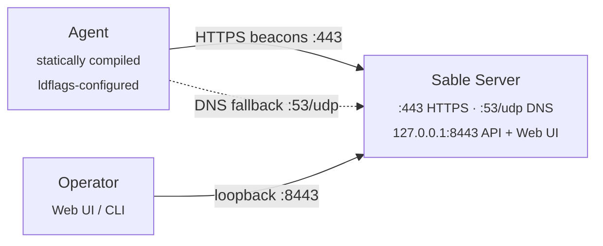

# Architecture



Each beacon is AES-256-GCM with an HKDF-derived key, then HMAC-SHA256'd over the agent ID and ciphertext (encrypt-then-MAC). Binding the agent ID into the MAC prevents cross-agent impersonation. A nonce cache rejects replays; the server drops anything outside a ±2 minute timestamp window.

## Network Ports

| Port | Bind | Purpose |
|------|------|---------|
| `443/tcp` | all interfaces | Agent HTTPS beacon listener. Needs root / admin to bind. |
| `8443/tcp` | `127.0.0.1` only | Operator web UI and REST API. Tunnel over SSH for remote access. |
| `53/udp` | all interfaces | Optional DNS beacon listener. Off unless the server is launched with `--dns-domain`, `SABLE_DNS_DOMAIN`, or `DNS_DOMAIN`. |

## Project Layout

```text
cmd/
  server/       - Sable server entry point (listeners + operator API)
  agent/        - agent entry point
  sablectl/     - unified install/start/rebuild/remove/doctor/reset helper
internal/
  agent/        - beacon loop, task execution, HTTPS/DNS transports,
                  persistent shell session (shell_session.go)
  agentlabel/   - shared label validation and UUID-prefix fallback
  api/          - operator REST API, JWT auth, middleware,
                  SSE terminal stream (terminal.go)
  cli/          - interactive operator CLI
  crypto/       - AES-256-GCM + HKDF + HMAC primitives
  listener/     - HTTPS and DNS beacon listeners, TLS cert handling
  nonce/        - TTL nonce cache for replay protection
  operatorpw/   - shared operator password file normalizer (BOM / UTF-16)
  protocol/     - beacon / task encode + decode
  session/      - in-memory session store with pub/sub for SSE
tools/
  setup/        - generates config.env + cert pair
  register/     - registers an agent via the REST API
  gensecret/    - prints a random agent ID + 32-byte secret
web/            - browser UI (HTML/CSS/JS), embedded into the server binary
agents/         - per-agent env files for additional identities (gitignored)
builds/         - per-agent build artifacts keyed by label (gitignored)
config.env      - generated by `sablectl install` (gitignored - secrets)
sable-state.json - persisted server state: agents, queues, output, notes, audit (gitignored - secrets)
server.crt      - generated by `sablectl install` (gitignored)
server.key      - generated by `sablectl install` (gitignored)
```
